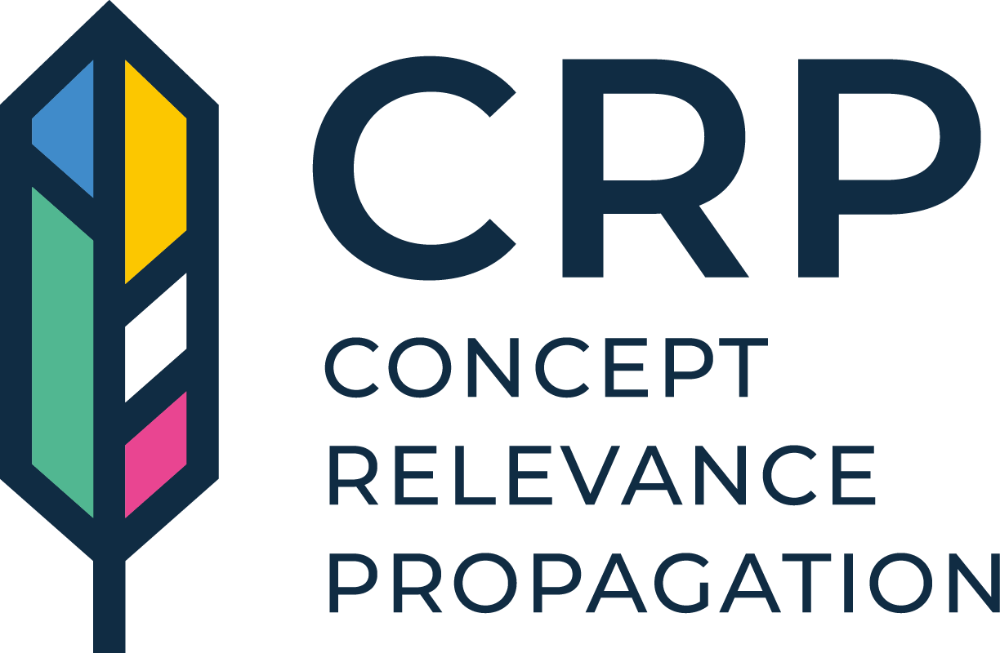
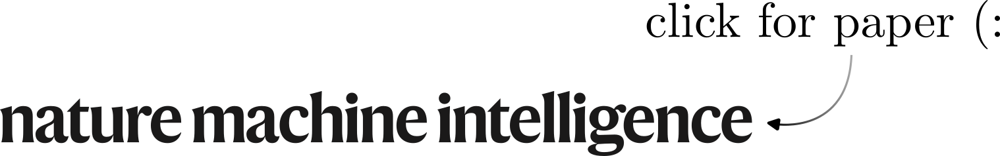
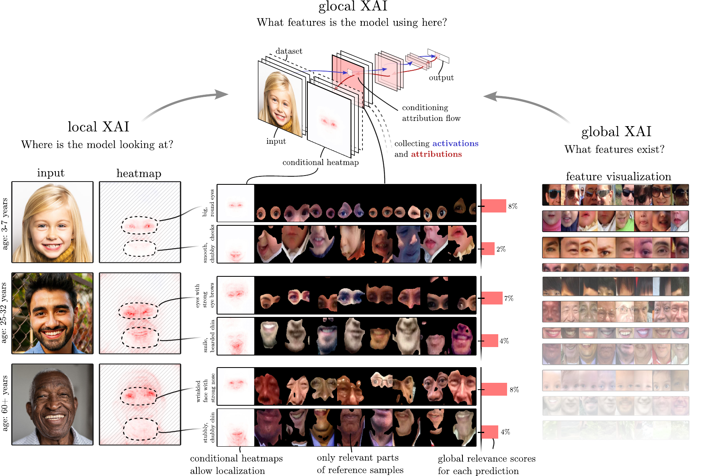
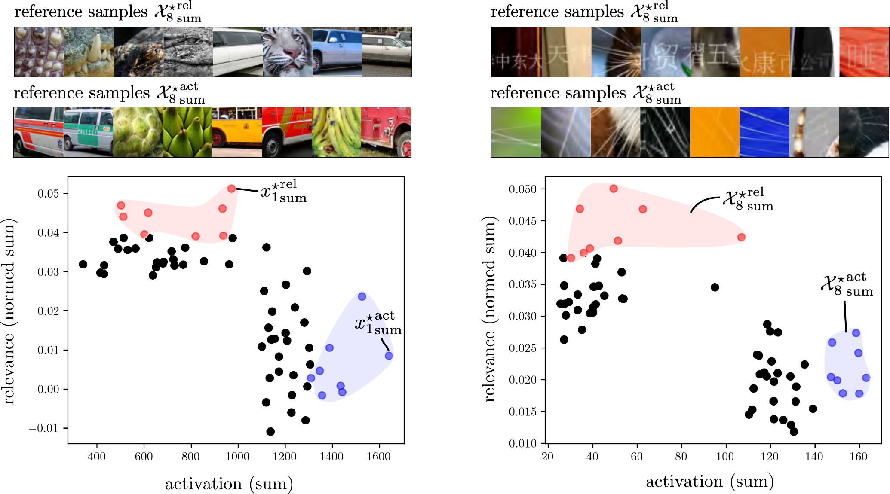

<div align="center">
  
  <p>An open-source pytorch library for neural network interpretability built on <a href="https://github.com/chr5tphr/zennit">zennit</a>.<br>
  Read the paper now as part of <a href="https://www.nature.com/articles/s42256-023-00711-8">Nature Machine Intelligence</a> (Open Access)</p>
</div>

<h3 align="center">
  <a href="https://www.nature.com/articles/s42256-023-00711-8">
    
  </a>
</h3>

[](https://badge.fury.io/py/zennit-crp)


## ❔ From “Where” to “What”

Traditional heatmaps are rather
uninformative despite being class-specific.
Here in the overview figure below, heatmaps only hint at the locations of relevant body parts, but what feature(s) in particular the model has recognized in those regions remains open for interpretation by the stakeholder, which, depending on the domain, may prove to be highly ambiguous. In this case, they indicate that the model seems to focus on the eye region during inference in all cases, **but what is it that the model finds so important about these eyes?**

With CRP, we immediately recognize that the topmost sample has been predicted into age group (3-7)
due to the sample’s large irides and round eyes, while the middle sample is predicted as (25-32), as
more of the sclera is visible and eyebrows are more ostensible. For the bottom sample the model
has predicted class (60+) based on its recognition of heavy wrinkles around the eyes and on the
eyelids, and pronounced tear sacs next to a large knobby nose.



### 🌊 Concepts are like waves in the sea  
Typically, backpropagation-based attribution methods iteratively propagate attribution scores from one network output of choice through all hidden units of a neural network towards the model input, without consideration for the specific
role and semantic meaning of latent structures of the model involved in the inference process. 

Contemporary deep learning literature, however, agrees that latent
structures of neural networks are capable of encoding abstract human-understandable concepts with distinct semantics, especially in higher layers. The influence of each concept on the final prediction is superimposed, like waves in the sea, and in the final heatmap all these information flows are mixed together, effectively hiding the individual contribution of latent concepts and rendering their specific meaning
inaccessible to the human observer.

### 🏄 Disentangling Attribution Flows 
With CRP, we propose a method to disentangle the attribution flows associated with concepts learned by the model via conditional backpropagation i.e. masking of relevance flows, resulting in explanations being presented as distinct concept-conditional 
relevance maps for network units that are most relevant for the prediction.

### 🔍 Revealing the meaning of a concept
A canonical approach for gaining insight into the meaning and function
of latent model structures is Activation Maximization (ActMax) 
for generating or selecting samples as representations for concepts encoded in hidden space. We find, however, that (maximizing) the activation of a latent encoding by a given data point does not always correspond to its utility to the model in an inference context, as adversarial examples demonstrate - putting the faithfulness of activation-based example selection
for latent concept representation into question.
We therefore introduce Relevance Maximization (RelMax), as an alternative measure to ActMax, with the objective to maximize the relevance criterion for the selection of representative samples for latent model features. 



(Left) According to RelMax, the coarse/gray pattern detector is by the model mainly utilized to classify reptiles instead of fruits. In hindsight, the bananas and artichokes obtained via ActMax structurally match the scale pattern of reptiles, however the color saturation overshoots.

(Right) ActMax suggests that the neuron's function consists of the detection of thin white lines, since spider webs or whiskers are visible in the images. On the other hand, samples drawn to maximize relevance mostly depict written characters. Thus, activation indicates which general pattern a filter activates, whereas relevance clarifies its specific usage in classification.

### 📃 Citation
```
@article{achtibat2023attribution,
  title={From attribution maps to human-understandable explanations through Concept Relevance Propagation},
  author={Achtibat, Reduan and Dreyer, Maximilian and Eisenbraun, Ilona and Bosse, Sebastian and Wiegand, Thomas and Samek, Wojciech and Lapuschkin, Sebastian},
  journal={Nature Machine Intelligence},
  volume={5},
  number={9},
  pages={1006–1019},
  year={2023},
  doi={10.1038/s42256-023-00711-8},
  url={https://doi.org/10.1038/s42256-023-00711-8},
  issn={2522-5839},
  publisher={Nature Publishing Group UK London}
}
```

## Project status

Project is under development but should be stable. Please expect interfaces to change in future releases.

## Installation

To install directly from PyPI using pip, write:

```shell
$ pip install zennit-crp[fast_img]
```

Alternatively, install from a manually cloned repository to try out the tutorials:

```shell
$ git clone https://github.com/rachtibat/zennit-crp
$ pip install ./zennit-crp
```

## Documentation

Still under development, but you can refer to the tutorials below.
Docstrings are also missing in some places.

## Tutorials

Check out the [jupyter notebook tutorials.](https://github.com/rachtibat/zennit-crp/tree/master/tutorials) Please start with attribution and then feature_visualization.

## Quickstart

### Conditional Attributions

```python
from crp.attribution import CondAttribution
from crp.concepts import ChannelConcept
from crp.helper import get_layer_names

from zennit.composites import EpsilonPlusFlat
from zennit.canonizers import SequentialMergeBatchNorm

# define LRP rules and canonizers in zennit
composite = EpsilonPlusFlat([SequentialMergeBatchNorm()])

# load CRP toolbox
attribution = CondAttribution(model)

# here, each channel is defined as a concept
# or define your own notion!
cc = ChannelConcept()

# get layer names of Conv2D and MLP layers
layer_names = get_layer_names(model, [nn.Conv2d, nn.Linear])

# get a conditional attribution for channel 50 in layer features.27 wrt. output 1
conditions = [{'features.27': [50], 'y': [1]}]

attr = attribution(data, conditions, composite, record_layer=layer_names)

# heatmap and prediction
attr.heatmap, attr.prediction
# activations and relevances for each layer name
attr.activations, attr.relevances

# relative importance of each concept for final prediction
rel_c = cc.attribute(attr.relevances['features.40'])
# most relevant channels in features.40
concept_ids = torch.argsort(rel_c, descending=True)
```

### Feature Visualization

```python
from crp.visualization import FeatureVisualization
from crp.image import plot_grid

# define which concept is used in each layer
layer_map = {name: cc for name in layer_names}

# compute visualization (it takes for VGG16 and ImageNet testset on Titan RTX 30 min)
fv = FeatureVisualization(attribution, dataset, layer_map)
fv.run(composite, 0, len(dataset))

# visualize MaxRelevance reference images for top-5 concepts
ref_c = fv.get_max_reference(concept_ids[:5], 'features.40', 'relevance', composite=composite)

plot_grid(ref_c)
```

## Roadmap
- [ ] Distributed HPC-Cluster support
- [ ] Complete MaskHook Tutorial
- [ ] Documentation


## Contributing

We use [PEP8](https://www.python.org/dev/peps/pep-0008) with a line-width of 120 characters. For
docstrings we use [numpydoc](https://numpydoc.readthedocs.io/en/latest/format.html).

We use [`pylint`](https://pypi.org/project/pylint/) for style checks.

Basic tests are implemented with [`pytest`](https://docs.pytest.org/).

We are open to any improvements (:

## License

BSD 3-Clause Clear License
