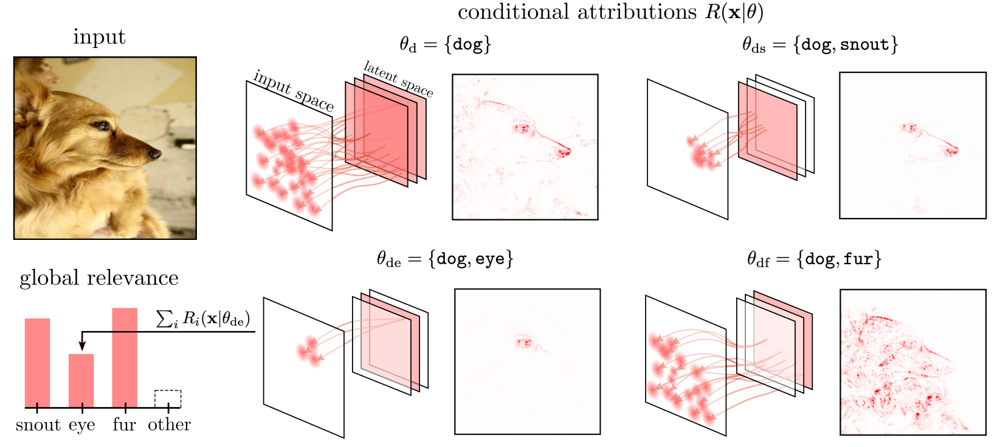
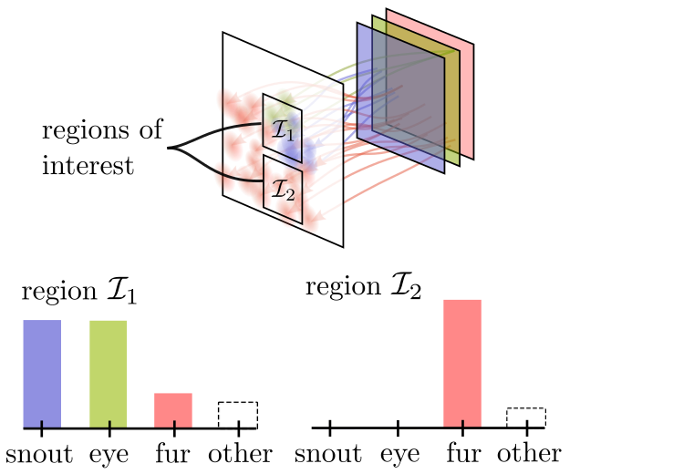
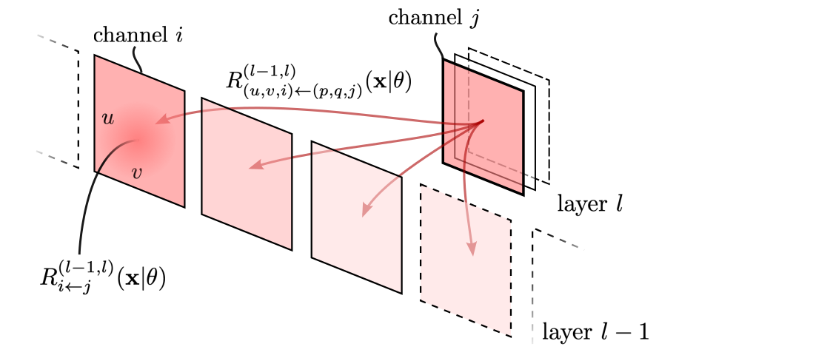

# Concept Relevance Propagation and Relevance Maximization

Zennit-crp is an open-source library for neural network interpretability built on [zennit](https://github.com/chr5tphr/zennit).

## **Concept Relevance Propagation (CRP)**
computes conditional attributions for in latent space defined concepts that allow to
- localize concepts in input space
- compute their relative importance to the final classification output
- and hierarchically decompose higher-level concepts into low-level concepts

In addition, this repository ships with

## **Relevance Maximization**

an explaining-by-example strategy for concepts that illustrates the most <em>useful</em> pattern for prediction, unlike _Activation Maximization_, which reveals patterns that lead to _strong activation_.

## **Activation Maximization**
as reference sampling approach and class-wide statistics are also supplied for comparision.

Curious? Then take a look at our [paper](https://arxiv.org/abs/2206.03208):

```
@article{achtibat2022from,
  title = {From "Where" to "What": Towards Human-Understandable Explanations through Concept Relevance Propagation},
  author  = {Achtibat, Reduan and
             Dreyer, Maximilian and
             Eisenbraun, Ilona and
             Bosse, Sebastian and
             Wiegand, Thomas and
             Samek, Wojciech and
             Lapuschkin, Sebastian},
  journal={arXiv},
  year = {2022},
  volume={abs/2206.03208},
  doi     = {10.48550/ARXIV.2206.03208},
  url     = {https://arxiv.org/abs/2206.03208},
}

```

## Why Concept Relevance Propagation?

For a detailed discussion, feel free to check out the paper, but here we will give a summary of the most exciting features:

<details>
  <summary>Overview</summary>
CRP applied on three age range predictions given different input samples from the Adience dataset
for age and gender estimation.


**(Left):** Traditional heatmaps are rather
uninformative despite being class-specific.
Here, heatmaps only hint at the locations of relevant body parts, but what feature(s) in particular the model has recognized in those regions remains open for interpretation by the stakeholder, which, depending on the domain, may prove to be highly ambiguous. In this case, they indicate that the model seems to focus on the eye region during inference in all cases.

**(Rightmost):** Intermediate features encoded by the model in general
can be investigated using global XAI (Activation or Relevance Maximization). Choosing a particular layer, individual channels can be
assigned concepts. However, during
inference, global XAI alone does not inform which features are recognized, used and combined
by the model in per-sample inference.

**(Center):** By combining local and global XAI, _glocal_ XAI is able to assign (relevance) attribution scores to individual neuron(-group)s. This tells, which concepts have been involved in a particular prediction. Further, concept-conditional heatmaps can be computed, indicating where a recognized concept identified as relevant has its origin in a sample’s input space. Vice versa, choosing a specific region in input space, the local relevance attribution, responsible concepts can be traced
back. Lastly, peripheral information can be masked out of the shown reference examples using
conditionally computed heatmap attributions for further focusing the feature visualization on the
concept’s defining parts, which increases interpretability and clarity:

Concentrating on the eye region, we immediately recognize that the topmost sample has been predicted into age group (3-7)
due to the sample’s large irides and round eyes, while the middle sample is predicted as (25-32), as
more of the sclera is visible and eyebrows are more ostensible. For the bottom sample the model
has predicted class (60+) based on its recognition of heavy wrinkles around the eyes and on the
eyelids, and pronounced tear sacs next to a large knobby nose.

</details>

<details>
  <summary>Disentangling Explanations</summary>



Target concept “dog” is described by a combination of lower-level concepts such as “snout”, “eye” and “fur”. CRP heatmaps regarding individual concepts, and their contribution to the prediction of “dog”, can be generated by applying masks to filter-channels in the backward pass. Global (in the context of an input sample) relevance of a concept wrt. to the explained prediction can thus not only be measured in latent space, but also precisely visualized, localized and measured in input space. The concept-conditional computation reveals the relatively high importance of the spatially distributed “fur” feature for the prediction of “dog”, compared to the feature “eye”.

</details>

<details>
  <summary>Localization of Concepts</summary>



CRP applied in combination with local aggregation of relevance scores over regions $I_1$ and $I_2$ in order to locally assess conceptual importance and localize concepts involved in inference.

</details>

<details>
  <summary>Relevance vs. Activation Maximization</summary>

Activation- and relevance-based sample selection.


**a)** Activation scores only measure
the stimulation of a latent filter without considering its role and impact during inference. Relevance scores are contextual to distinct model outputs and describe how features
are utilized in a DNN’s prediction of a specific class.

**b)** As a result, samples selected
based on Activation Maximization only represent maximized latent neuron activation, while
samples based on Relevance Maximization represent features which are actually useful and
representative for solving a prediction task.

_(A) ActMax identifies a concept that encodes for white strokes. RelMax, however, shows that this concept is not simply used to find white strokes, but white characters!_

**c)** Assume we wish to find representative examples for features $x_1$
and $x_2$. Even though a sample leads to a high activation score in a given layer and neuron (group) — here $x_1$ and $x_2$ — it does not necessarily result in high relevance or contribution to inference: The feature transformation $w$ of a linear layer with inputs $x_1$ and $x_2$, which is followed by a ReLU non-linearity, is shown. Here, samples from the blue cluster of feature activations lead to high activation values for both features $x_1$ and $x_2$, and would be selected by ActMax, but receive zero relevance, as they lead to an inactive neuron output after the ReLU, and are thus of no value to following layers. That is, even though
the given samples activate features $x_1$ and $x_2$ maximally strong, they can not contribute
meaningfully to the prediction process through the context determined by $w$. Thus, samples
selected as representative via activation might not be representative to the overall decision
process of the model. Representative examples selected based on relevance, however, are
guaranteed to play an important role in the model’s decision process.

**d):** Correlation analyses are shown for an intermediate ResNet layer’s channel and neuron. Neurons that are on average highly activated are not, in general, also highly relevant, as a correlation coefficient of $c = 0.111$ shows, since a specific combination of activation magnitudes is important for neurons to be representative in a larger model context.

</details>

<details>
  <summary>Hierarchical Concept Decomposition through Attribution Graphs</summary>

Decomposing a high-level concept into its lower-level concepts.



Given an interesting concept encoded by channel j in layer l, relevance quantities computed during a CRP backward pass can then be utilized to identify how its relevance distributes across lower layer channels (here shown side-by-side in an exploded view).

</details>

## Project status

Project is under active development but should be stable. Please expect interfaces to change in future releases.

## Installation

To install directly from PyPI using pip, use:

```shell
$ pip install zennit-crp
```

Alternatively, install from a manually cloned repository to try out the tutorials:

```shell
$ git clone https://github.com/rachtibat/zennit-crp
$ pip install ./zennit-crp
```

## Documentation

Still under development, but you can refer to the tutorials below.
Docstrings are also missing in several places.

## Tutorials

Check out the [jupyter notebook tutorials.](https://github.com/rachtibat/zennit-crp/tree/master/tutorials)

## Quickstart

### Conditional Attributions

```python
from crp.attribution import CondAttribution
from crp.concepts import ChannelConcept
from crp.helper import get_layer_names

from zennit.composites import EpsilonPlusFlat
from zennit.canonizers import SequentialMergeBatchNorm

# define LRP rules and canonizers in zennit
composite = EpsilonPlusFlat([SequentialMergeBatchNorm()])

# load CRP toolbox
attribution = CondAttribution(model)

# here, each channel is defined as a concept
# or define your own notion!
cc = ChannelConcept()

# get layer names of Conv2D and MLP layers
layer_names = get_layer_names(model, [nn.Conv2d, nn.Linear])

# get a conditional attribution for channel 50 in layer features.27 wrt. output 1
conditions = [{'features.27': [50], 'y': [1]}]

attr = attribution(data, conditions, composite, record_layer=layer_names)

# heatmap and prediction
attr.heatmap, attr.prediction
# activations and relevances for each layer name
attr.activations, attr.relevances

# relative importance of each concept for final prediction
rel_c = cc.attribute(attr.relevances['features.40'])
# most relevant channels in features.40
concept_ids = torch.argsort(rel_c, descending=True)
```

### Feature Visualization

```python
from crp.visualization import FeatureVisualization
from crp.image import plot_grid

# define which concept is used in each layer
layer_map = {(name, cc) for name in layer_names}

# compute visualization (it takes for VGG16 and ImageNet testset on Titan RTX 30 min)
fv = FeatureVisualization(attribution, dataset, layer_map)
fv.run(composite, 0, len(dataset))

# visualize MaxRelevance reference images for top-5 concepts
ref_c = fv.get_max_reference(composite, concept_ids[:5], 'features.40', 'relevance')

plot_grid(ref_c)
```

## Roadmap

Coming soon...

- [ ] Masking of Reference Images
- [ ] Replacing ReceptiveField class with ad hoc computation for maximal versatility
- [ ] Caching for Feature Visualization
- [ ] Complete MaskHook Tutorial
- [ ] Visualization for the Attribution Graph

## Contributing

### Code Style

We use [PEP8](https://www.python.org/dev/peps/pep-0008) with a line-width of 120 characters. For
docstrings we use [numpydoc](https://numpydoc.readthedocs.io/en/latest/format.html).

We use [`pylint`](https://pypi.org/project/pylint/) for style checks.

Tests are still missing.

We are open to any improvements (:

## License

BSD 3-Clause Clear License
